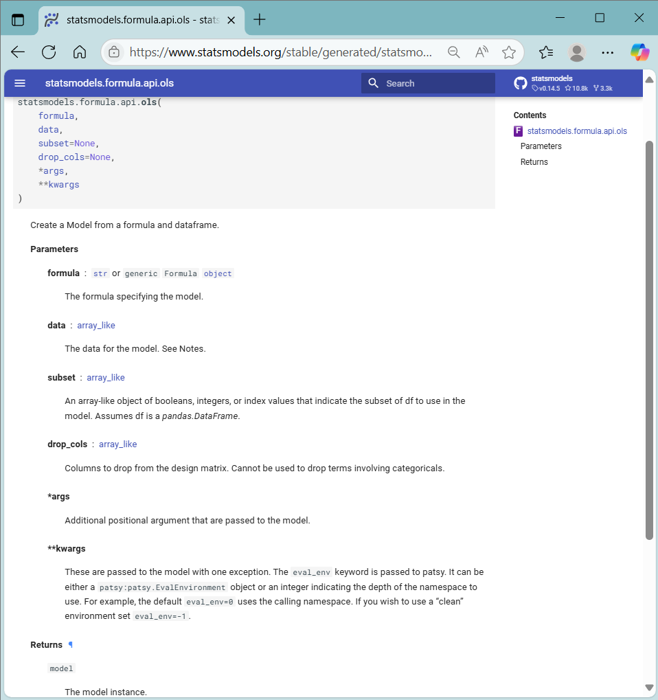
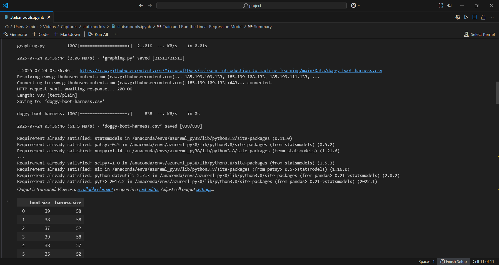
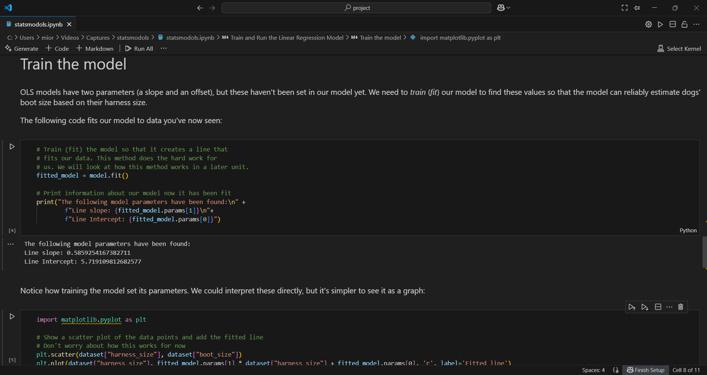
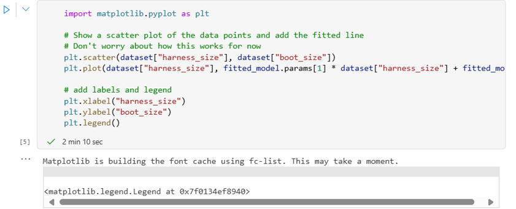
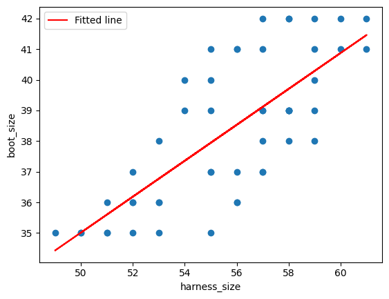
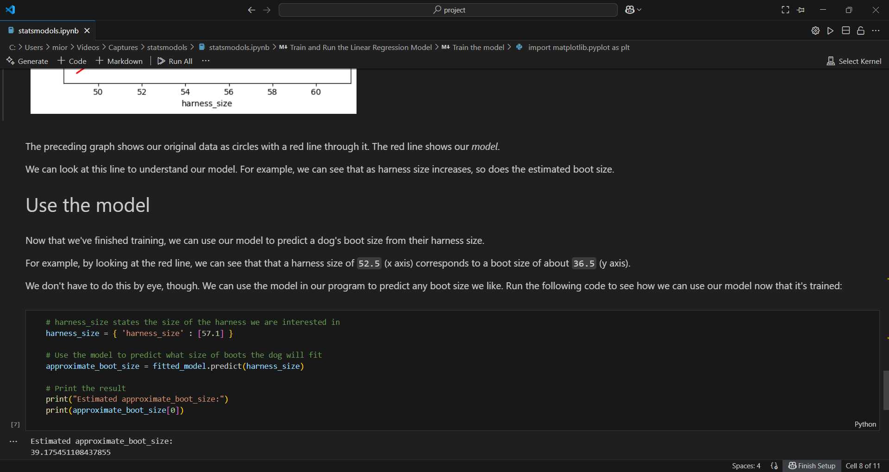

# statsmodols
statsmodols : Linear Regression Model # statsmodels.formula.api.ols # train # fit # pandas # matplotlib # statistics

## Objectives
- To create and test a Linear Regression Machine Learning Model.
- Specifying models using formula strings and DataFrames
- To estimate parameters of linear regression model by minimizing sum of squared residuals using statistical OLS method.

## OLS Linear Regression ML Model

### OLS Regression Model General Formula
Predicted Value = β₀ + β₁·x₁ + β₂·x₂ + ... + βₚ·xₚ + ϵ

Where:
- β₀ = intercept
- β₁, β₂, ..., βₚ = regression coefficients
- x₁, x₂, ..., xₚ = input features (independent variables)
- ϵ = error term (residual)

